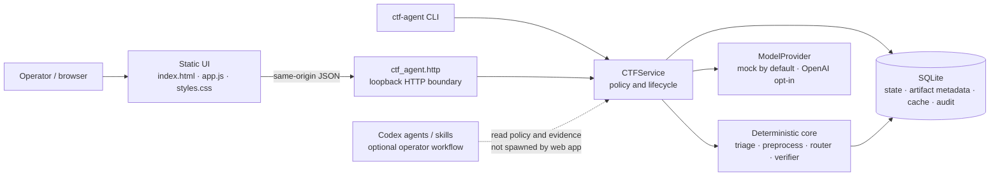
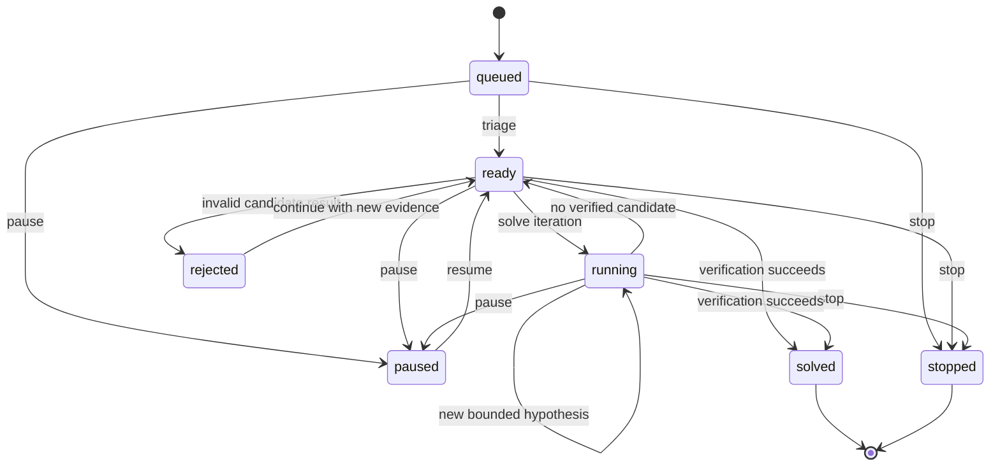

# CTF Agent

CTF Agent คือ dashboard แบบ local-first สำหรับจัดการโจทย์ CTF ที่ได้รับอนุญาต โดยรวม
challenge state, scope allowlist, token budget, model routing, prompt-injection signals,
verification และ audit ไว้ใน UI เดียว Runtime ใช้ Python standard library เท่านั้นและ
เริ่มด้วย mock provider จึงไม่เรียก AI หรือ target ภายนอกโดยไม่ตั้งใจ

> ใช้กับ CTF และ intentionally vulnerable infrastructure ที่ได้รับอนุญาตเท่านั้น
> แนะนำให้รันใน disposable VM ที่ไม่มีไฟล์ส่วนตัวหรือ long-lived credentials ระบบไม่
> submit flag ให้อัตโนมัติ

## Quick start

ต้องการ Python 3.12 ขึ้นไป:

```bash
python3 -m ctf_agent health
python3 -m ctf_agent serve
```

เปิด `http://127.0.0.1:8765` ข้อมูลจะอยู่ที่ `.ctf-agent/state.db` และเริ่มด้วยฐานข้อมูลว่าง
หากต้องการ demo records สำหรับดู UI ให้ opt in:

```bash
python3 -m ctf_agent serve --demo
```

เลือก host, port หรือ database ได้โดยไม่ต้องติดตั้ง package:

```bash
python3 -m ctf_agent serve --host 127.0.0.1 --port 9000 --db .ctf-agent/event.db
```

หรือ install แบบ editable เพื่อใช้ entry point:

```bash
python3 -m pip install -e .
ctf-agent serve
```

ดู options ที่รองรับจริงด้วย `python3 -m ctf_agent serve --help` และ
`python3 -m ctf_agent health --help`

## สิ่งที่ระบบทำ

- รับคำอธิบายและไฟล์โจทย์แบบ bounded พร้อม SHA-256/type/size metadata และ deterministic preprocessing แบบ read-only/cached
- classify `web`, `pwn`, `reverse`, `crypto`, `forensics`, `misc`, `osint`,
  `hardware`, `stego` ด้วย deterministic signals ก่อน
- ตรวจ prompt injection และ AI token-burn โดยถือ challenge content เป็น untrusted data
- route แบบ tools → Luna → Terra → Sol ตาม complexity, evidence, budget และ call cap
- ป้องกัน global reserve อย่างน้อย 20% และแยก per-challenge allocation
- หยุด path เมื่อ failure ซ้ำ, ไม่มี marginal progress หรือเกิน iteration limit
- บังคับ target allowlist ก่อน operator-declared network solve path
- ตรวจ candidate จาก flag format และ replay bounded deterministic evidence จาก bytes ต้นฉบับก่อน solved; คำยืนยันจาก client ถูกบันทึกเป็น note เท่านั้น
- แก้ crypto fixture แบบ offline ที่มี prerequisite ชัดเจน: RSA low-exponent exact root, RSA shared-prime GCD และ single-byte XOR พร้อม replay relation
- เพิ่ม bounded crypto routes จาก picoCTF 2024–2026: chained Base64/Caesar, custom reverse/XOR scaling, cyclical self-source decoding และ detection ของ large consecutive-point interpolation โดยไม่สร้าง dense Vandermonde matrix
- เก็บ SQLite state และ audit โดยไม่ส่ง flag ไป CTF platform

MVP นี้เป็น orchestration console ไม่ใช่ malware sandbox หรือ autonomous scanner ตัว
service ไม่เปิด Ghidra/gdb/scanner และไม่ spawn Codex agents เอง Category playbooks และ
custom agents ใน repository นี้ใช้เมื่อผู้ใช้เปิดโปรเจกต์ด้วย Codex

สำหรับ pwn/reverse/APK/firmware ที่ต้อง execute ต้องมี Docker image หรือ disposable VM
ที่ operator จัดเตรียมและอนุมัติทีละ action ก่อนเสมอ ดู [sandbox execution boundary](docs/SANDBOX_EXECUTION.md)
ระบบจะไม่ pull image หรือรัน binary ที่ import เข้ามาบน host โดยอัตโนมัติ

## Architecture

CTF-Agent แยกส่วนที่รับข้อมูลโจทย์, ตัดสินใจตาม policy, เรียก model และเก็บหลักฐานออกจากกัน
เพื่อไม่ให้ UI, model หรือ challenge content ข้ามขอบเขตความปลอดภัยได้เอง ทุก request ที่
เปลี่ยนสถานะต้องผ่าน `CTFService`; HTTP handler และ JavaScript ไม่เขียน SQLite โดยตรง



### Runtime components

| Layer | Responsibility | Important boundary |
| --- | --- | --- |
| `ctf_agent.__main__` | CLI, server lifecycle, health check, playbook/benchmark/archive commands | Validates CLI input before starting a service or approved local helper. |
| `ctf_agent.http` | Loopback HTTP server, JSON parsing, static assets and API routing | Applies request/static-path limits; never exposes Python tracebacks or local paths to the browser. |
| `ctf_agent.service.CTFService` | Challenge lifecycle, scope check, budget accounting, audit and action orchestration | The only application layer allowed to mutate challenge state. |
| `ctf_agent.core` | Hashing, type signals, bounded preprocessing, category classification, injection/burn signals, routing and circuit breakers | Deterministic and network-free; raw artifacts are not copied into prompts. |
| `ctf_agent.providers` | Structured model-provider abstraction | `mock` is local and default; `openai` needs an explicit setting and environment gate. A provider cannot change scope or spend reserve by itself. |
| `ctf_agent.storage` | SQLite schema, transactions, cache and audit persistence | Local DB may contain artifacts/candidate flags, so it is ignored by Git. |
| `ctf_agent.sandbox` | Explicit, bounded Docker inspection interface | Requires an approved action and never automatically executes a supplied binary. |
| `ctf_agent.recipes`, `deterministic_solvers`, `playbooks` | Reusable offline transforms, evidenced solver routes and read-only discovery | Helpers are deterministic; a suggested playbook is not authority to contact an instance. |
| `ctf_agent/static/` | No-build dashboard UI | Consumes only the documented same-origin API contract. |

### Request and evidence lifecycle

1. The operator imports a description and optional artifacts. The service records name, size,
   media type and SHA-256; it does not modify the original source file.
2. Bounded deterministic preprocessors derive only the signals needed for triage (for example
   archive member metadata, PNG structure or ELF headers). The classifier assigns a category
   and confidence before a model is considered.
3. `CTFService` checks lifecycle state, exact scope authorization, per-challenge budget,
   global budget and protected reserve. A failed gate becomes an audit event rather than a
   silently permissive fallback.
4. The router chooses the cheapest justified tier: local tool first, then Luna, Terra and only
   evidence-backed Sol escalation. Repeated no-progress paths trip a circuit breaker.
5. Facts, hypotheses, routing reason, token use and artifacts are persisted with audit records.
   The browser sees a compact projection; it never receives a database connection.
6. A candidate flag is accepted as `solved` only after format validation and bounded,
   artifact-derived replay evidence. The operator submits a verified candidate manually.

### State model



`solved` and `stopped` are terminal states. A rejected candidate is recorded in audit but does
not turn the challenge into a success. The status values exposed by the API are `queued`,
`ready`, `running`, `paused`, `stopped`, `solved` and `rejected`.

### Security and trust boundaries

The authority order is deliberate:

1. Operator policy, configured scope and explicit approval.
2. Application policy and its validated settings.
3. Deterministic tools and model output.
4. Challenge descriptions, OCR, artifacts, webpages and all tool output.

The lowest layer is always untrusted. A string in a challenge cannot authorize network access,
reserve spending, a model change, file-system access or flag submission. Network is disabled by
default, UI/API bind to loopback, external model calls are opt-in, and the SQLite state directory
is excluded from version control. See [Threat model](docs/THREAT_MODEL.md) and
[Sandbox execution](docs/SANDBOX_EXECUTION.md) for the operational details.

### Repository layout

```text
ctf_agent/                 Application package and static dashboard
tests/                     Unit, API and deterministic-regression tests
docs/                      Architecture, threat model, UI and policy documents
benchmarks/crypto/         Blind crypto benchmark schema and report templates
knowledge/                 Reusable, non-flag research notes
tools/                     Bounded local forensic/crypto helper sources
sandbox/                   Read-only Docker inspection baseline
.agents/skills/            Codex CTF router/category/writeup workflows
.codex/                    Codex agent profiles and command guard
config.example.json        Public settings-payload example
AGENTS.md                  Repository-wide CTF-only operating policy
ctf_challenges/            Local-only evidence/workspaces; intentionally ignored by Git
```

`ctf_challenges/` is intentionally not versioned: it can include event artifacts, candidate
flags, browser state, cookies, PCAP/APK/ZIP payloads and large generated tables. Keep it local
or in a separately approved encrypted evidence store. Only reusable, reviewed material belongs
under `knowledge/`, `tools/` or the Codex skills folders.

## Workflow ใน UI

1. เปิด Settings และกำหนด global/per-challenge budget; คง `provider=mock` ระหว่าง setup
2. เพิ่ม target ที่ได้รับอนุญาตใน Security & Audit หากโจทย์ต้องใช้ remote service
3. เพิ่ม Challenge พร้อม description, flag format, target และไฟล์
4. ตรวจ category confidence, burn score, artifact metadata และกด Triage
5. ทำ Solve ทีละ iteration ดู routing reason/token charge แล้ว pause เมื่อข้อมูลไม่เพิ่ม
6. ใส่ candidate flag แล้วกด Verify เพื่อ replay หลักฐานจาก artifact; reproduction note อย่างเดียวไม่ทำให้ solved
7. ส่ง flag จริงด้วยตนเองบน platform ของการแข่งขันหลังระบบแสดง verified

สถานะที่รองรับคือ `queued`, `ready`, `running`, `paused`, `stopped`, `solved` และ
`rejected`

ตัวอย่าง artifact, transcript และ writeup ระหว่างการฝึกเก็บแยกใน local-only
`ctf_challenges/` เพื่อไม่ปะปนกับ source repository หรือเผยแพร่ candidate flag ออกนอก
เครื่อง บทเรียนที่นำกลับมาใช้ซ้ำจาก picoCTF 2025–2026 อยู่ใน
`.agents/skills/ctf-router/references/picoctf-2025-2026.md` และไม่รวม flag ไว้ใน skill
reference

### Thailand Cyber Top Talent research set

งานเตรียมแข่งที่อ้างอิง write-up สาธารณะถูกแยกไว้ใน
[`knowledge/thailand_cyber_top_talent/`](knowledge/thailand_cyber_top_talent/)
ในสถานะ `RESEARCH_ONLY` เพื่อไม่ปะปนกับผลที่ verifier ยืนยันแล้ว โดยไม่มีการนำ flag
จากบทความมาอ้างว่าสำเร็จ. คู่มือ Wireshark/binwalk และตัวช่วย bounded สำหรับ PCAP,
DNS-hex และ zlib อยู่ที่
[`knowledge/tooling/wireshark-binwalk-crypto.md`](knowledge/tooling/wireshark-binwalk-crypto.md)
และ `tools/forensics/` ตามลำดับ.

ขั้นตอนตรวจความพร้อมก่อนแข่งและคำสั่งแยกฐานข้อมูลของสำเนา `CTF-Agent2` อยู่ใน
[`docs/COMPETITION_READINESS.md`](docs/COMPETITION_READINESS.md)

### Reusable local recipes

กระบวนการแปลงที่เกิดซ้ำถูกแยกไว้ใน `ctf_agent/recipes.py` เพื่อให้ challenge
workspace เรียกใช้โดยไม่ต้องเขียนใหม่:

```python
from ctf_agent.recipes import (
    atbash, caesar, flag_candidates, sha256_file,
    strict_b64_decode, vigenere_decrypt, xor_repeating,
    rsa_low_exponent_recover,
)
```

มี Caesar/Atbash, whole-string flag check, SHA-256 แบบอ่านเป็น chunk และ
`extract_steghide_empty_passphrase()` ที่เรียก `steghide` แบบ argv, ไม่ใช้ shell,
มี timeout และเขียนเฉพาะ output path ที่ระบุ Workspace solver ควรเก็บ artifact hash,
assumptions และ writeup แยกจากกันเสมอ เพื่อไม่ให้ evidence ของโจทย์หนึ่งปนกับอีกโจทย์หนึ่ง

นอกจากนี้มี Vigenere, strict Base64, repeating-key XOR และ exact-root RSA แบบมี
cap สำหรับยกไปใช้ใน workspace ใหม่ได้ทันที โดย helper เหล่านี้เป็น pure/local
transform และไม่ทำ network I/O

### Crypto playbook registry

Catalog แบบ read-only ใน `ctf_agent/playbooks.py` ช่วยจัดอันดับ deterministic route จาก
evidence ที่พบโดยไม่ต้องเริ่มจากการเดา:

```bash
python3 -m ctf_agent playbooks --validate
python3 -m ctf_agent playbooks --category rsa
python3 -m ctf_agent playbooks --suggest "RSA e=3 ciphertext and modulus"
python3 -m ctf_agent playbooks rsa/exact-low-exponent
```

คำสั่งนี้เพียงค้นหา evidence gate, deterministic first check, verification rule
และ command template จะไม่ execute solver, เปิด socket หรือส่ง flag เอง เส้นทางที่ต้อง
ใช้ instance ถูกทำเครื่องหมาย `network-gated` และยังต้อง allowlist/อนุมัติ target
รายครั้งตาม policy เดิม. การ validate เส้นทางที่ชี้ไปยัง local evidence pack จะต้องมี
workspace นั้นอยู่ใน `ctf_challenges/`; evidence pack ดังกล่าวไม่ได้เผยแพร่ใน repository

### Blind competitive crypto benchmark

โครงสร้าง benchmark ตาม MASTER PROMPT อยู่ใน `benchmarks/crypto/` พร้อม
manifest template, JSONL result schema และ report template โดยยังไม่มีการนับผล
เพราะต้องเติม dataset non-picoCTF ที่ได้รับอนุญาตครบ 10 intermediate, 10
advanced และ 10 expert ก่อน:

```bash
python3 -m ctf_agent benchmark validate \
  --manifest benchmarks/crypto/manifest.json \
  --root benchmarks/crypto/dataset --complete
python3 -m ctf_agent benchmark payload \
  --manifest benchmarks/crypto/manifest.json \
  --root benchmarks/crypto/dataset --id crypto_001
python3 -m ctf_agent benchmark report \
  --manifest benchmarks/crypto/manifest.json \
  --root benchmarks/crypto/dataset \
  --results benchmarks/crypto/results.jsonl \
  --output benchmarks/crypto/BENCHMARK_REPORT.md
```

ตัวตรวจจะซ่อน tier/ปี/ผู้เขียน/คะแนนจาก blind payload, ปฏิเสธ marker ของ
writeup/solution ใน primary dataset, แยก `CONTAMINATED` ออกจากสถิติ และไม่เปิด
network หรือส่ง flag เอง ดูรายละเอียดที่
[`benchmarks/crypto/README.md`](benchmarks/crypto/README.md)

## Safe defaults และ configuration

ค่าเริ่มต้นสำคัญ:

```text
provider             mock
network_enabled      false
global budget        500,000 tokens
challenge budget      50,000 tokens
protected reserve         20%
max Sol calls                 2
max iterations               12
```

[config.example.json](config.example.json) เป็น settings payload ตัวอย่างที่ตรงกับ
public validation contract ของ service แต่แอปไม่อ่านไฟล์นี้อัตโนมัติ ปรับค่าผ่านหน้า
Settings หรือ `PATCH /api/settings`

### เปิด OpenAI provider แบบ explicit

Mock provider ไม่ต้องใช้ key และไม่เรียก network หากต้องการใช้ provider จริง ให้ตรวจ
กติกาการแข่งขันและ data policy ก่อน แล้วจึง:

```bash
export CTF_AGENT_ENABLE_OPENAI=1
export OPENAI_API_KEY="<set in your shell, never commit it>"
python3 -m ctf_agent serve
```

จากนั้นเปลี่ยน provider เป็น `openai` ใน Settings การตั้ง environment อย่างเดียวไม่พอ
และระบบไม่อ่านหรือแสดงค่า key ใน API/audit `network_enabled` เป็น gate สำหรับ CTF
target ไม่ใช่การยินยอมส่ง challenge context ไป model provider

Model/account availability เปลี่ยนแปลงได้ ควรทดสอบ slugs ใน `tier_models` และ budget
ด้วยโจทย์จำลองก่อนแข่ง

## ใช้ร่วมกับ Codex

Repository นี้มี project policy, agents, skills และ hook ตามรูปแบบ Codex ปัจจุบัน:

```text
AGENTS.md                         CTF-only policy
.codex/config.toml                sandbox/network/concurrency defaults
.codex/agents/*.toml              specialized subagents
.codex/hooks.json                 PreToolUse registration
.codex/hooks/command_guard.py     Bash guardrail
.agents/skills/*/SKILL.md         router/category/writeup workflows
```

หมวดวิธีทำถูกแยกเป็น progressive-disclosure playbook แล้ว: `ctf-web` ครอบคลุม
access control, auth/session, REST/GraphQL, sinks, uploads, outbound fetch, browser,
XXE และ race/business logic, prototype pollution และ parser/cache boundaries; `ctf-pwn` มี
stack, format string, indirect-call, heap, parser/logic และ syscall/kernel sandbox
boundaries; `ctf-reverse` มี native checks, constraints, packers, APK/DEX/JNI, JVM,
WebAssembly, firmware, custom VM และ obfuscation; `ctf-crypto` มี XOR/stream, block
modes, RSA, ECC/signatures, hash/MAC, custom algebra, DH, ZKP, isogeny และ bounded
lattice, PRNG checks; `ctf-forensics` มี archive, disk, PCAP, media, logs, memory, firmware,
browser databases และ multi-source timelines. อ่านเฉพาะ `references/archetypes.md` หรือ `references/playbook.md`
ของหมวดที่ triage เลือก เพื่อไม่ยัดรายละเอียดทุกประเภทเข้า context พร้อมกัน

หมวดที่ยังไม่มี capability แยก (`stego`, `OSINT`, hardware interface, mobile live-app,
blockchain network และ `misc`) จะถูก route เป็น bounded bridge หรือ `paused_unsupported`
ตาม [triage-and-routing.md](.agents/skills/ctf-router/references/triage-and-routing.md)
แทนการเดาว่า skill ข้างเคียงทำแทนได้ สำหรับการทบทวนหลักการทั่วไป ใช้แหล่งฝึกที่ตั้งใจ
ให้ทดสอบ เช่น [picoCTF learning resources](https://picoctf.org/resources.html),
[PortSwigger Web Security Academy](https://portswigger.net/web-security/all-topics),
[pwn.college](https://pwn.college/), และ [CryptoHack](https://cryptohack.org/challenges/)
โดยนำกลับมาเฉพาะ signal, prerequisite, bounded check และ verification rule ไม่คัดลอก
flag หรือขั้นตอนโจมตีไปใช้กับระบบจริง

สำหรับโจทย์ Unix/Linux แบบ Bandit มี skill แยกที่
`.agents/skills/ctf-bandit/` พร้อมแผนที่เทคนิคระดับ 0–33 ใน
`references/level-map.md`; ระดับ 34 ยังไม่มีตามหน้าเว็บทางการ

หลังเปิด repository ที่เชื่อถือได้ใน Codex ให้ใช้ `/hooks` เพื่อตรวจและ trust hook ก่อน
เริ่มงาน จากนั้นสั่งตัวอย่าง:

```text
Use $ctf-router for this authorized challenge. Start with deterministic triage,
keep network off, protect the reserve, and ask verifier to check any candidate flag.
```

Agents ที่มี:

| Agent | Tier | หน้าที่ |
| --- | --- | --- |
| `triage` | Luna/low | read-only metadata/category/burn handoff |
| `web`, `pwn`, `forensics` | Terra/medium | category solve แบบ bounded |
| `reverse`, `crypto` | Terra/high | category reasoning ที่หนาแน่นขึ้น |
| `verifier` | Terra/high | independent read-only reproduction check |
| `archivist` | Luna/low | concise writeup/knowledge distillation |
| `deep_solver` | Sol/ultra | final escalation หนึ่ง hypothesis เท่านั้น |

`deep_solver` ไม่ใช่ default และจะปฏิเสธเมื่อไม่มี cheaper-tier failures, focused question,
budget หรือ burn score ที่ปลอดภัย Project จำกัด subagents พร้อมกัน 4 threads เพราะงาน
ขนานทุก thread ใช้ token ของตัวเอง

### Scope สำหรับ Bash hook

Codex project sandbox ปิด network เป็นค่าเริ่มต้น หาก operator เปิด network สำหรับโจทย์
ที่ได้รับอนุญาต ต้องเพิ่ม exact shell targets ให้ hook ด้วย:

```bash
export CTF_AGENT_ALLOWED_TARGETS="challenge.example.org,203.0.113.10"
```

รองรับ exact host/IP, explicit wildcard เช่น `*.challenge.example.org` และ bounded CIDR
รายการนี้แยกจาก scopes ใน SQLite; ตั้งทั้งคู่ให้ตรงกัน Hook block คำสั่งทำลาย host,
privilege/system mutation, secret paths, writes นอก repo, unsafe Docker และ network ที่
ตรวจ scope ไม่ได้ แต่ hook เป็น defense in depth ไม่ใช่ firewall/sandbox ที่สมบูรณ์

อ้างอิงรูปแบบ integration จาก official OpenAI documentation:
[Subagents](https://learn.chatgpt.com/docs/agent-configuration/subagents),
[Build skills](https://learn.chatgpt.com/docs/build-skills), และ
[Hooks](https://learn.chatgpt.com/docs/hooks)

## JSON API

UI ใช้ same-origin API ต่อไปนี้:

| Method | Path | Purpose |
| --- | --- | --- |
| GET | `/api/health` | local service/database/provider status |
| GET | `/api/bootstrap` | `{app, stats, challenges, scopes, settings, audit}` |
| GET/POST | `/api/challenges` | list/filter หรือ ingest challenge |
| GET | `/api/challenges/{id}` | challenge cockpit state |
| POST | `/api/challenges/{id}/actions/{action}` | `triage`, `solve`, `pause`, `resume`, `stop`, `verify` |
| GET/POST | `/api/scopes` | list/add allowlist entries |
| DELETE | `/api/scopes/{id}` | remove scope |
| GET/PATCH | `/api/settings` | validated public settings |
| GET | `/api/audit` | bounded audit timeline |

API bind ที่ loopback และไม่มี authentication จึงไม่ควร expose ไป LAN/Internet หากต้อง
แชร์ UI ต้องวางหลัง access control และ TLS ที่ผู้ใช้ดูแลเอง

## ตรวจสอบการติดตั้ง

```bash
python3 -m compileall -q ctf_agent .codex/hooks
python3 -m unittest discover -s tests -v
python3 -m ctf_agent health
```

## เอกสาร

- [Architecture](docs/ARCHITECTURE.md)
- [Threat model](docs/THREAT_MODEL.md)
- [Token policy](docs/TOKEN_POLICY.md)
- [Model routing](docs/MODEL_ROUTING.md)
- [UI guide](docs/UI_GUIDE.md)
